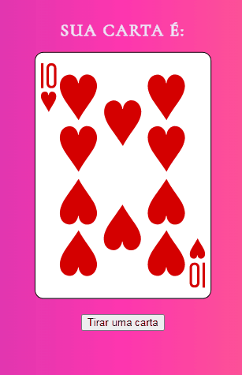

# Projeto API de cartas

Um projeto desenvolvido durante o curso DevQuest, utilizando uma API de cartas. O usuário consegue clicar no botão e uma carta aleatória é renderizada na tela. 

 [] 

## Meu processo

### Tecnologias utilizadas

- HTML
- CSS
- JavaScript

### O que aprendi

Importante para compreender o funcionamento de API's, e o método fetch.
Desde a estrutura do método quando a requisição é feita, até termos uma resposta retornando os dados que o fetch buscou. 
